# qc-alchemy · Selected transformations

精选 10 个项目实测案例。原图、风格参考、生成结果并排展示，点击图片可查看原文件。

[返回仓库首页](../../README.md) · [阅读技能说明](../../skills/published/qc-alchemy/SKILL.md) · [离线 HTML 画廊文件](index.html)

下载仓库后，用浏览器打开 `index.html` 可浏览离线画廊；在 GitHub 上直接浏览本页即可查看全部对照。

```bash
npx skills add https://github.com/AIDiscovery007/qc-skills --skill qc-alchemy
```

这些样例来自技能迭代过程，包含不同提示词版本与修正结果；并非最新技能一次运行的统一测试。图片按原文件复制，未在本次打包中重绘、裁切或调色。

## 案例索引 / Explore

| 模板重演 · 人像 | 场景与海报 | 保留结构换画法 |
| :--- | :--- | :--- |
| [梦幻星芒](#case-395) · [青蓝金纹](#case-394) | [水母夜城](#case-405) · [悬浮城市](#case-273) | [蜡笔伙伴](#case-400) |
| [钴蓝光镜](#case-388) · [翡翠红纱](#case-402) | [柑橘版画](#case-396) | |
| [星阶梦游](#case-407) · [珠光花冠](#case-393) | | |

[案例清单与文件校验值](manifest.json)

<a id="case-395"></a>

## 01 · 梦幻星芒 / Dreamlight

黑色剪影、粉红点阵眼镜与星芒把日常肖像重演为梦幻未来主义。

<table><tr><th width="25%">原图 · Source</th><th width="25%">参考 · Reference</th><th width="50%">结果 · Result</th></tr><tr><td><a href="01-395/source.jpg"></a></td><td><a href="01-395/reference.webp">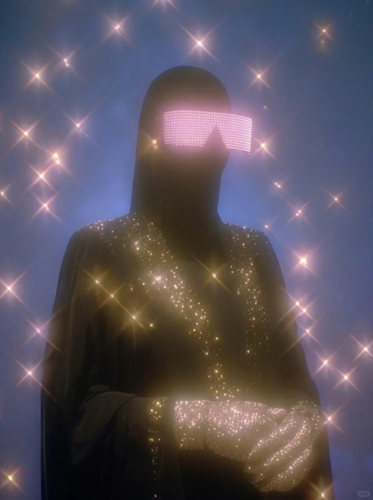</a></td><td><a href="01-395/result.png">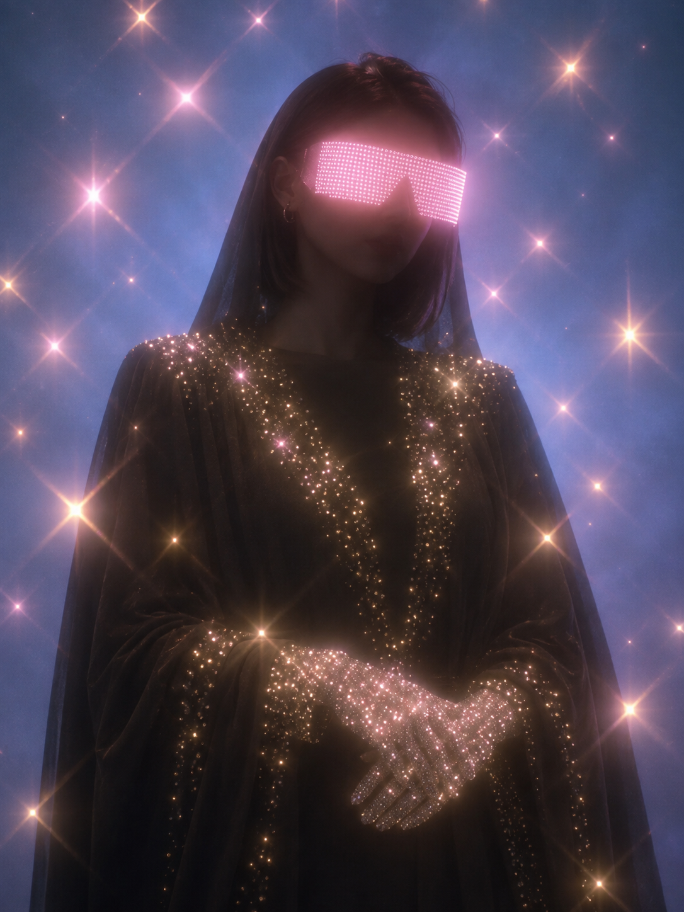</a></td></tr></table>

[实际生成提示词](01-395/prompt.txt) · [案例记录](01-395/case.json)

**生成条件：** 本次文件记录为原图＋模板生成；项目中存在较早395迭代，不能当作全项目首次尝试。

<details><summary>观察边界</summary>

面部按设计藏于阴影，不能据此验证精确五官身份；手部叠放可读。

</details>

<a id="case-394"></a>

## 02 · 青蓝金纹 / Gilded Tide

青蓝漫画、金色纹样和环绕云浪形成高度鲜明的视觉重构。

<table><tr><th width="25%">原图 · Source</th><th width="25%">参考 · Reference</th><th width="50%">结果 · Result</th></tr><tr><td><a href="02-394/source.jpg">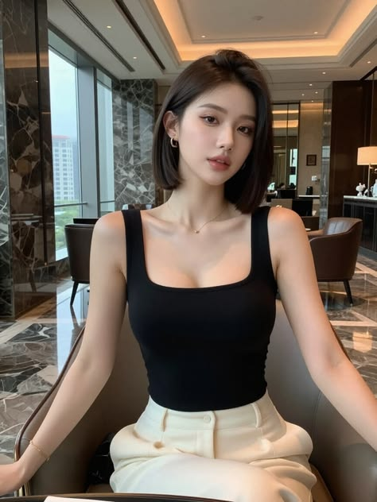</a></td><td><a href="02-394/reference.webp">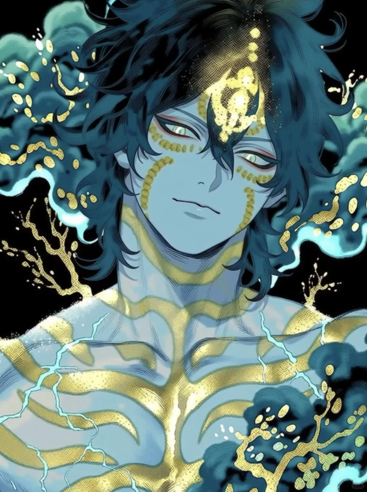</a></td><td><a href="02-394/result.png">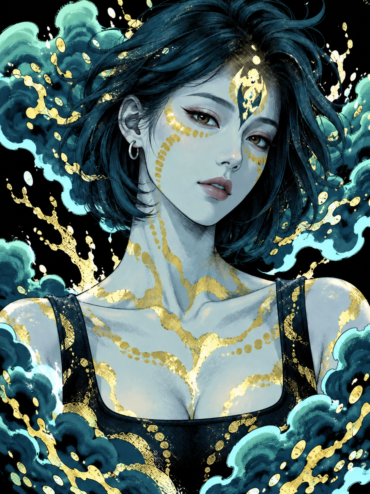</a></td></tr></table>

[实际生成提示词](02-394/prompt.txt) · [案例记录](02-394/case.json) · [后续清理提示词](02-394/cleanup-prompt.txt)

**生成条件：** 一次主体生成后有一次仅清理右下角角标的编辑；两步prompt均须保留。

<details><summary>观察边界</summary>

输出五官比模板更精细；最终版本已局部清除复制的角标。

</details>

<a id="case-405"></a>

## 03 · 水母夜城 / Jellyfish Nocturne

同一街区变成暖金灯阵与发光水母交织的奇幻水域。

<table><tr><th width="25%">原图 · Source</th><th width="25%">参考 · Reference</th><th width="50%">结果 · Result</th></tr><tr><td><a href="03-405/source.jpg">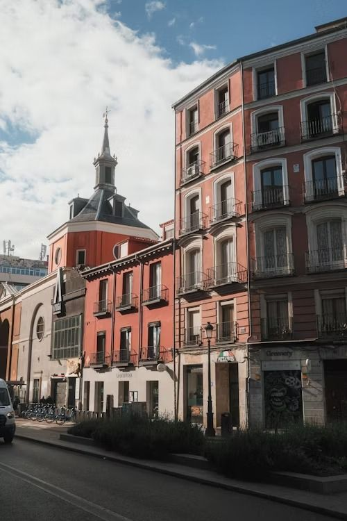</a></td><td><a href="03-405/reference.webp">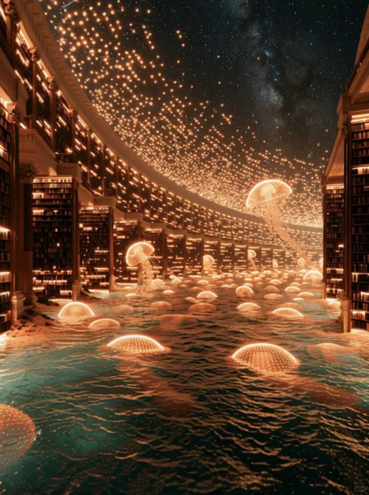</a></td><td><a href="03-405/result.png">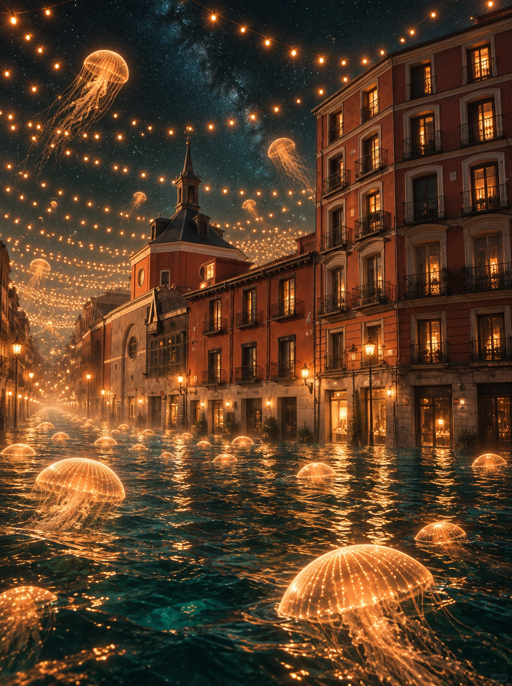</a></td></tr></table>

[实际生成提示词](03-405/prompt.txt) · [案例记录](03-405/case.json)

**生成条件：** 记录为该组首轮；无后续修正记录。

<details><summary>观察边界</summary>

重建道路为水面并增加奇幻元素，属于模板重演，不是严格保留结构。

</details>

<a id="case-273"></a>

## 04 · 悬浮城市 / Floating City

原建筑轮廓转成精细透明水层与悬浮地下剖面，跨场景效果强。

<table><tr><th width="25%">原图 · Source</th><th width="25%">参考 · Reference</th><th width="50%">结果 · Result</th></tr><tr><td><a href="04-273/source.jpg"></a></td><td><a href="04-273/reference.webp">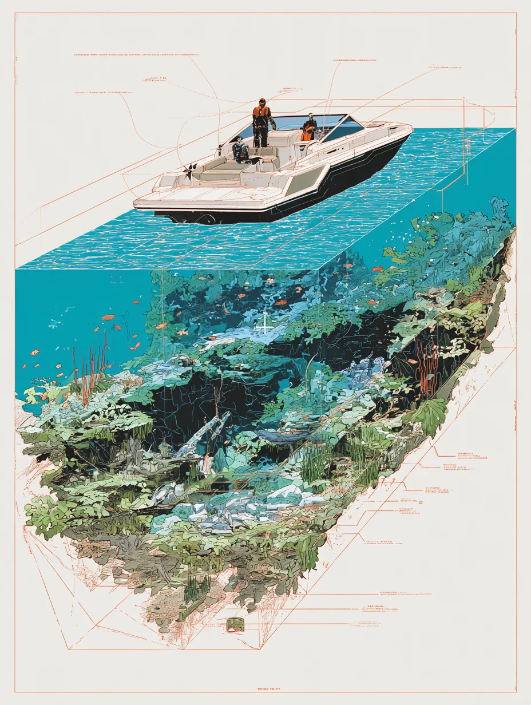</a></td><td><a href="04-273/result.png">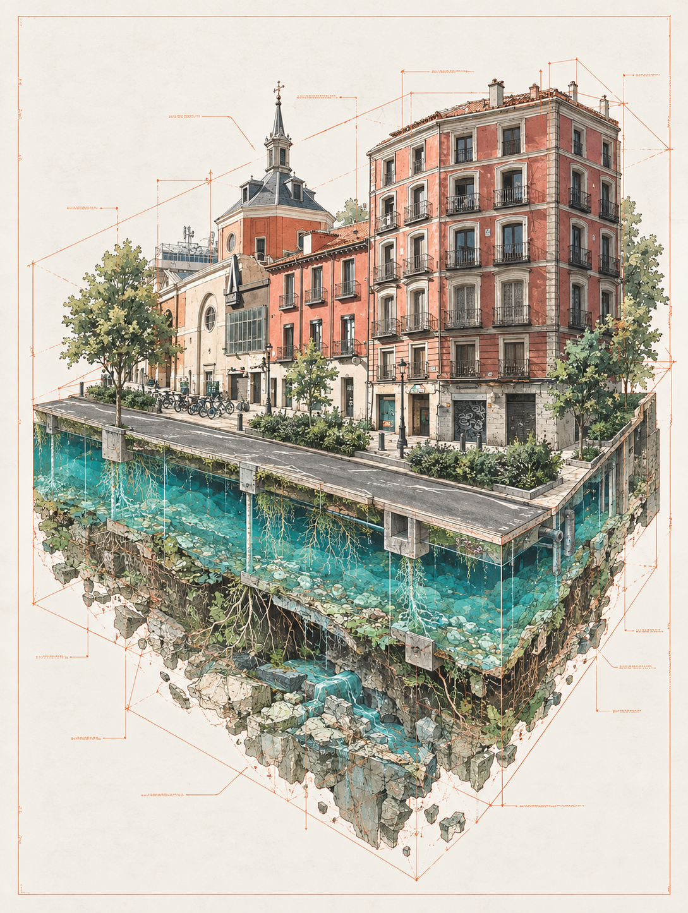</a></td></tr></table>

[实际生成提示词](04-273/prompt.txt) · [案例记录](04-273/case.json)

**生成条件：** 记录为该组生成版本；无后续修正记录。

<details><summary>观察边界</summary>

地下结构及细小标注是艺术想象，不是可用工程图。

</details>

<a id="case-388"></a>

## 05 · 钴蓝光镜 / Cobalt Visor

从犬类模板提取配色、透明镜片与立领，转译为女性未来肖像。

<table><tr><th width="25%">原图 · Source</th><th width="25%">参考 · Reference</th><th width="50%">结果 · Result</th></tr><tr><td><a href="05-388/source.jpg"></a></td><td><a href="05-388/reference.webp">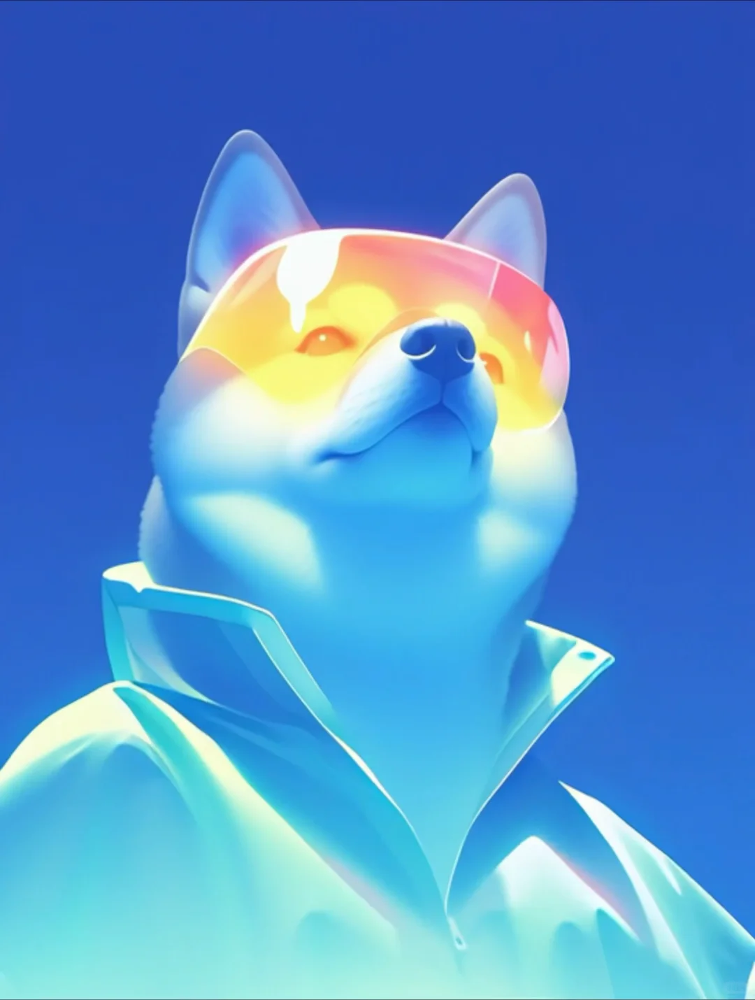</a></td><td><a href="05-388/result.png">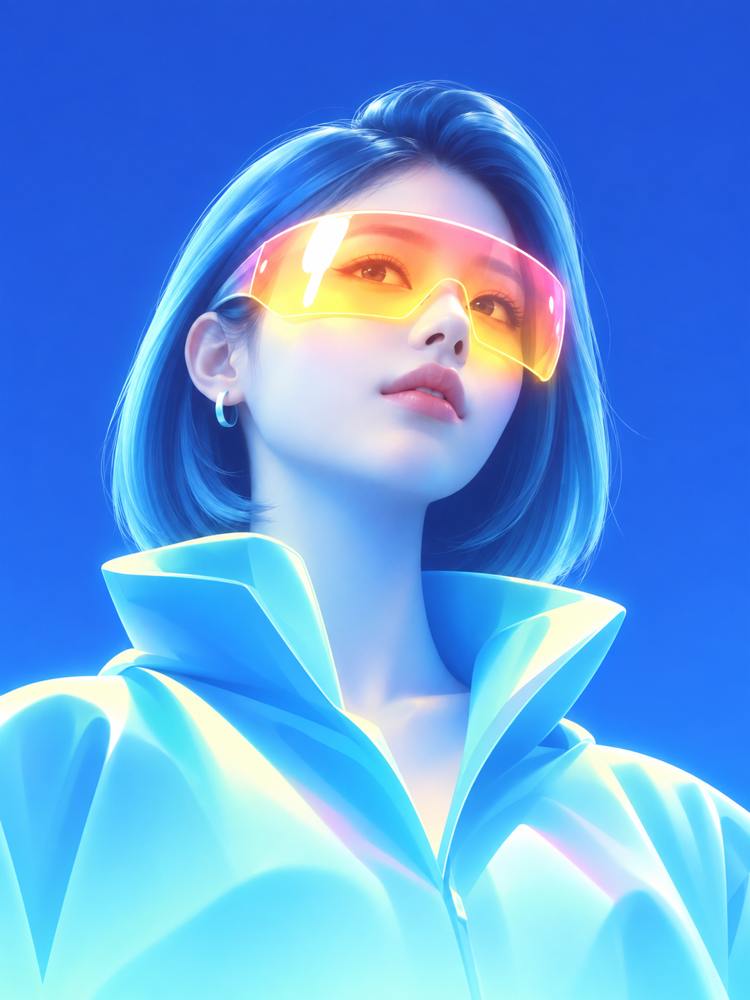</a></td></tr></table>

[实际生成提示词](05-388/prompt.txt) · [案例记录](05-388/case.json)

**生成条件：** 案例记录没有后续修正字段。

<details><summary>观察边界</summary>

人脸比参考犬模板更写实；跨物种适配有意改变形体。

</details>

<a id="case-396"></a>

## 06 · 柑橘版画 / Citrus Print

单颗橙子转为粗颗粒、有限套色与嵌字的食品海报。

<table><tr><th width="25%">原图 · Source</th><th width="25%">参考 · Reference</th><th width="50%">结果 · Result</th></tr><tr><td><a href="06-396/source.jpg">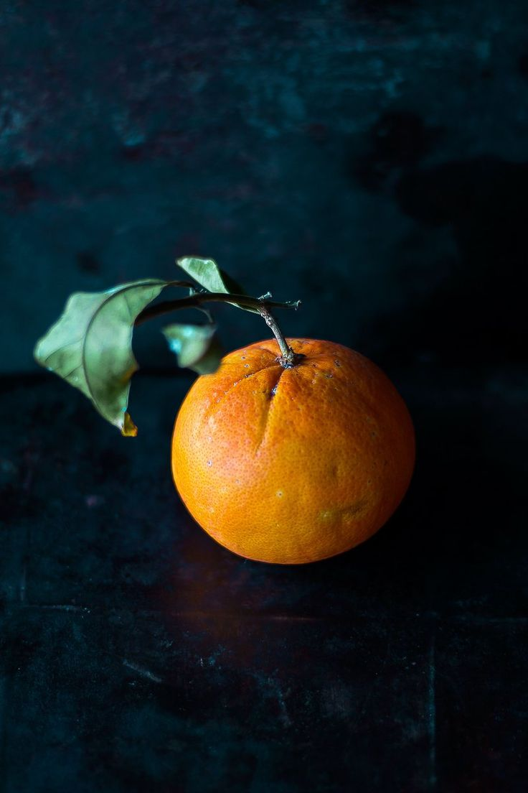</a></td><td><a href="06-396/reference.webp">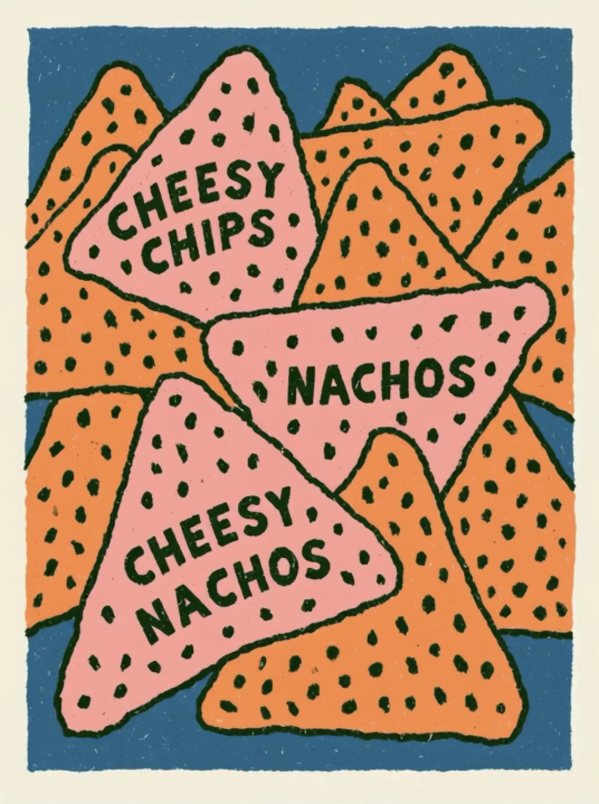</a></td><td><a href="06-396/result.png">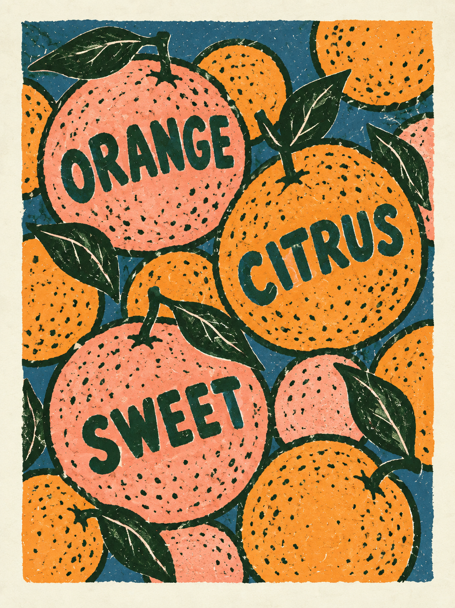</a></td></tr></table>

[实际生成提示词](06-396/prompt.txt) · [案例记录](06-396/case.json)

**生成条件：** jobs记录attempt=1。

<details><summary>观察边界</summary>

主动重复重排橙子并添加授权的ORANGE/CITRUS/SWEET文字。

</details>

<a id="case-402"></a>

## 07 · 翡翠红纱 / Emerald Veil

自然肤色肖像转为绿肤侧脸、透明红纱与深绿服饰。

<table><tr><th width="25%">原图 · Source</th><th width="25%">参考 · Reference</th><th width="50%">结果 · Result</th></tr><tr><td><a href="07-402/source.jpg">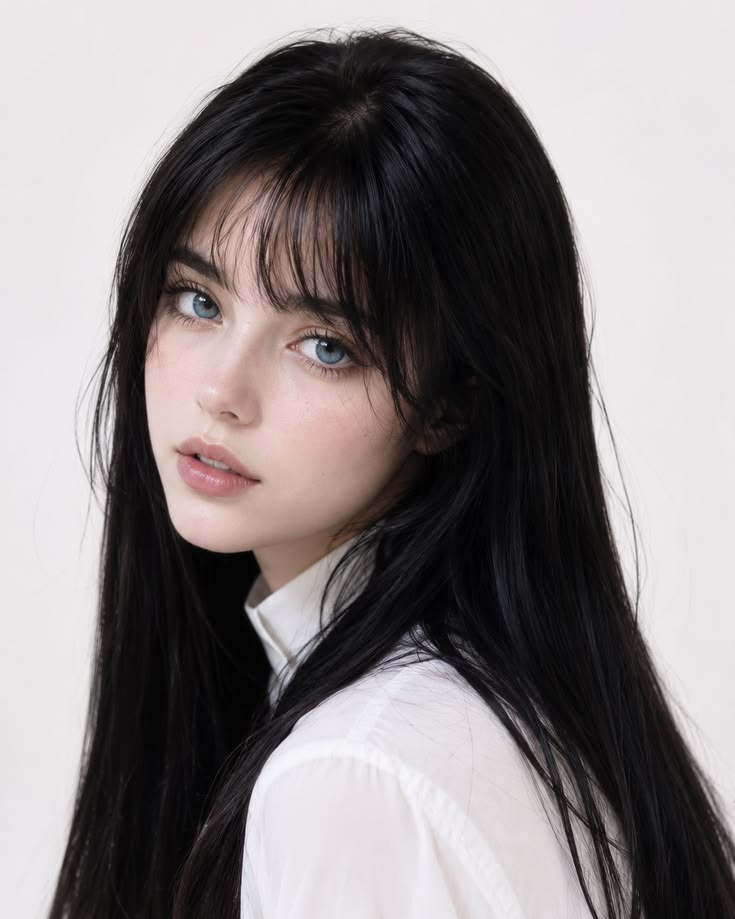</a></td><td><a href="07-402/reference.webp">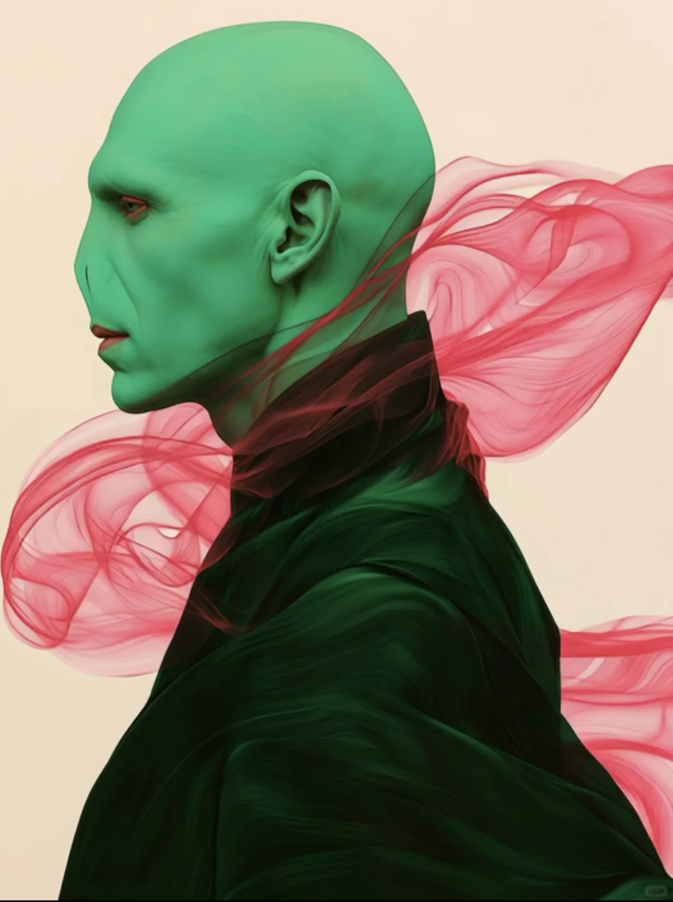</a></td><td><a href="07-402/result.png">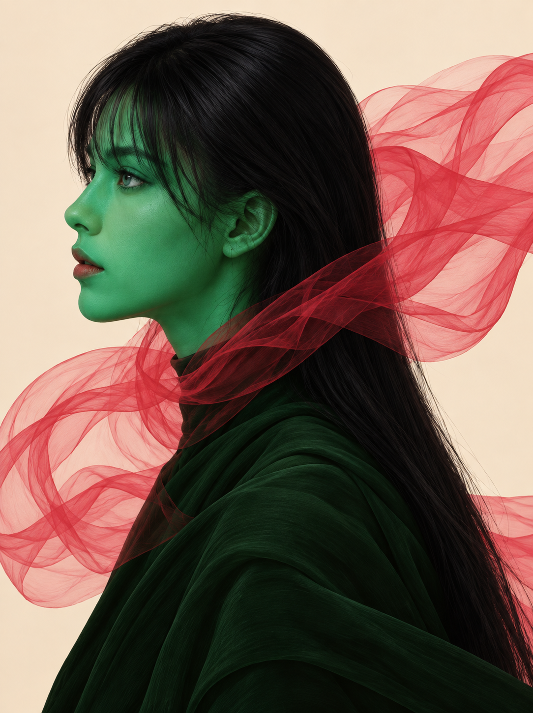</a></td></tr></table>

[实际生成提示词](07-402/prompt.txt) · [案例记录](07-402/case.json)

**生成条件：** 第3版，前两版后调整整体侧姿与取色；最终由原图＋模板重新生成。

<details><summary>观察边界</summary>

绿色仍比模板偏黄、饱和度略低，未完全复刻参考肤色。

</details>

<a id="case-407"></a>

## 08 · 星阶梦游 / Stairway Reverie

近景照片转成蘑菇、彩阶与星空中的完整坐姿，头颈衔接自然。

<table><tr><th width="25%">原图 · Source</th><th width="25%">参考 · Reference</th><th width="50%">结果 · Result</th></tr><tr><td><a href="08-407/source.jpg"></a></td><td><a href="08-407/reference.webp">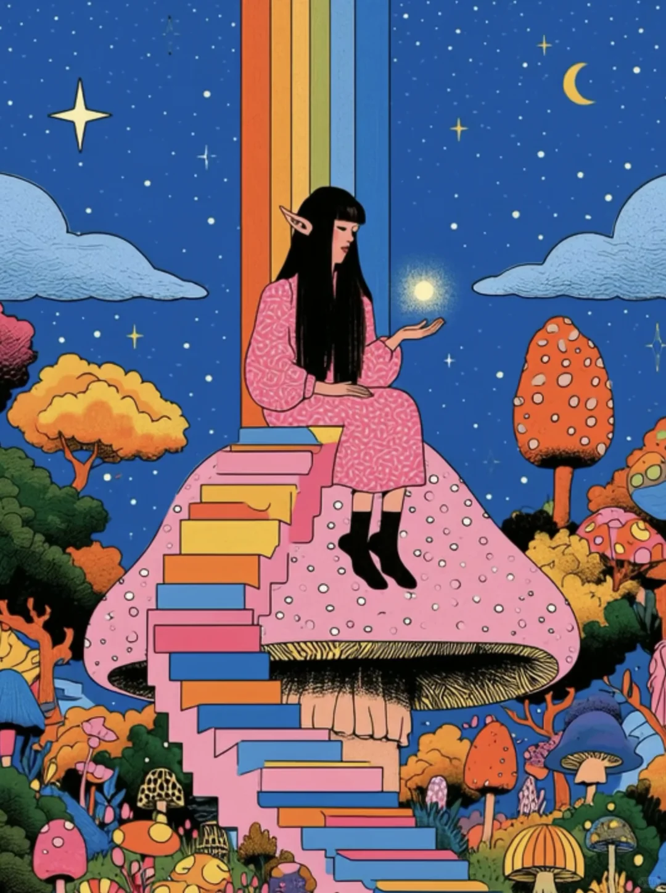</a></td><td><a href="08-407/result.png">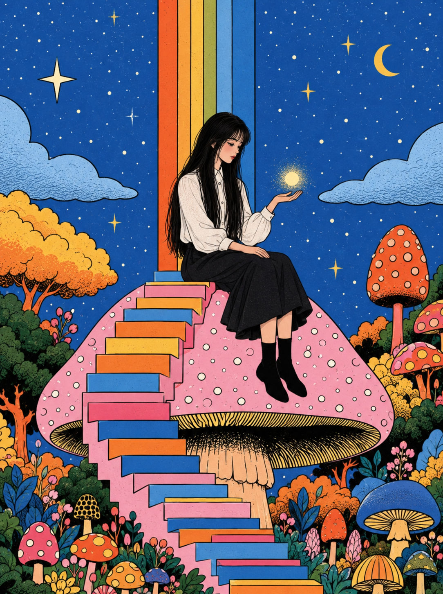</a></td></tr></table>

[实际生成提示词](08-407/prompt.txt) · [案例记录](08-407/case.json)

**生成条件：** 第3版，修复前轮头颈姿态问题；最终由原图＋模板重新生成。

<details><summary>观察边界</summary>

脸部为小尺寸概括侧面，不能验证精确虹膜和五官一致。

</details>

<a id="case-400"></a>

## 09 · 蜡笔伙伴 / Crayon Companion

保留狗与居家环境，用全画面蜡笔短触和纸齿将照片转为绘画。

<table><tr><th width="25%">原图 · Source</th><th width="25%">参考 · Reference</th><th width="50%">结果 · Result</th></tr><tr><td><a href="09-400/source.jpg">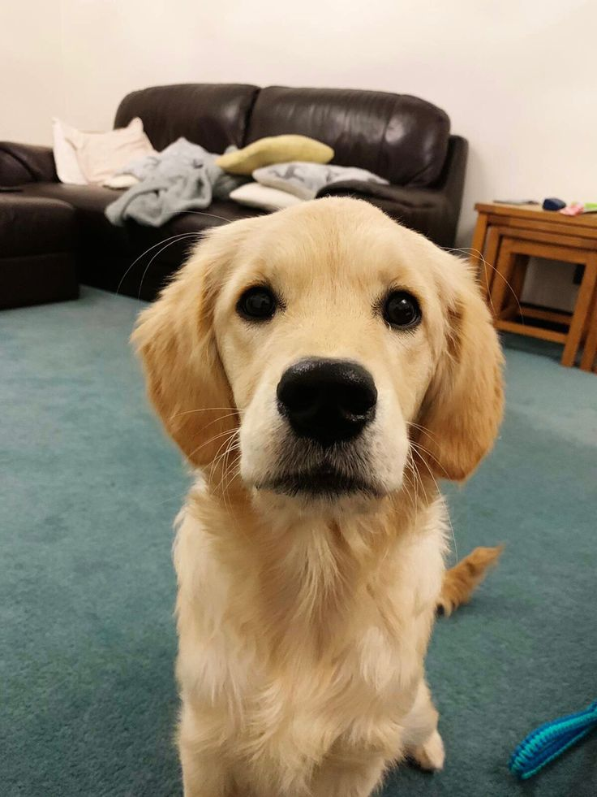</a></td><td><a href="09-400/reference.webp">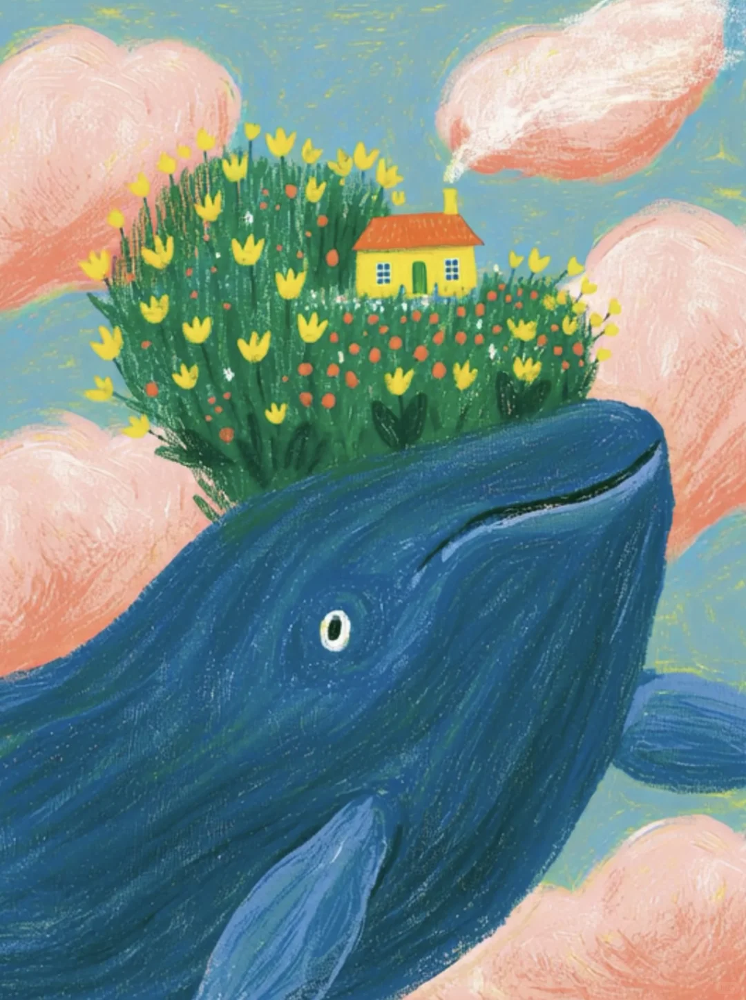</a></td><td><a href="09-400/result.png">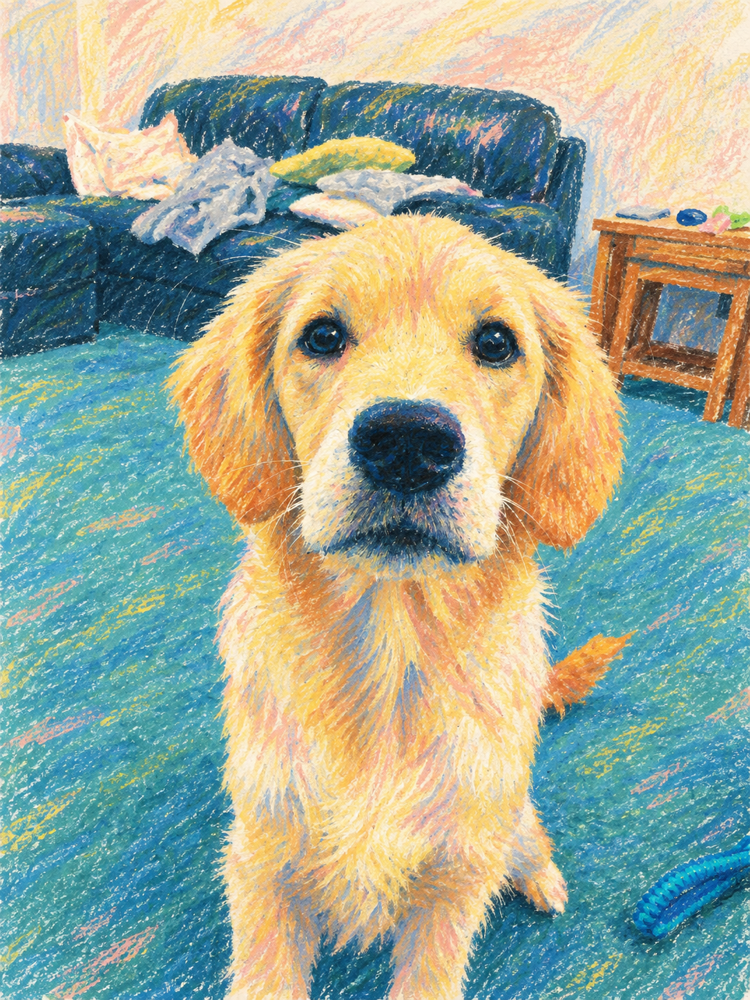</a></td></tr></table>

[实际生成提示词](09-400/prompt.txt) · [案例记录](09-400/case.json)

**生成条件：** 结构保留批次单独生成；无后续编辑记录。

<details><summary>观察边界</summary>

整体布局保留但小物细节与线条简化，不能宣称逐物像素级不变。

</details>

<a id="case-393"></a>

## 10 · 珠光花冠 / Pearlescent Bloom

粉蓝高明度、花瓣遮挡与珍珠宝石将普通人像改写为甜美幻想插画。

<table><tr><th width="25%">原图 · Source</th><th width="25%">参考 · Reference</th><th width="50%">结果 · Result</th></tr><tr><td><a href="10-393/source.jpg"></a></td><td><a href="10-393/reference.webp">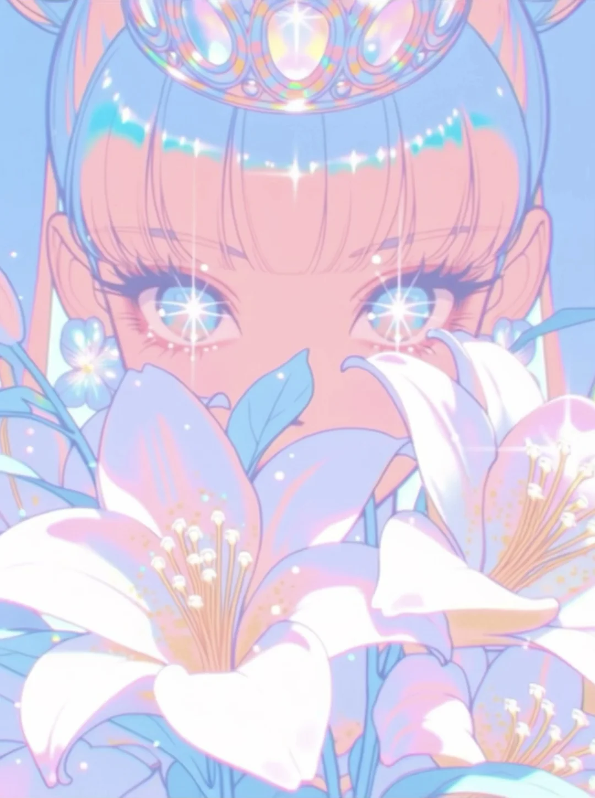</a></td><td><a href="10-393/result.png">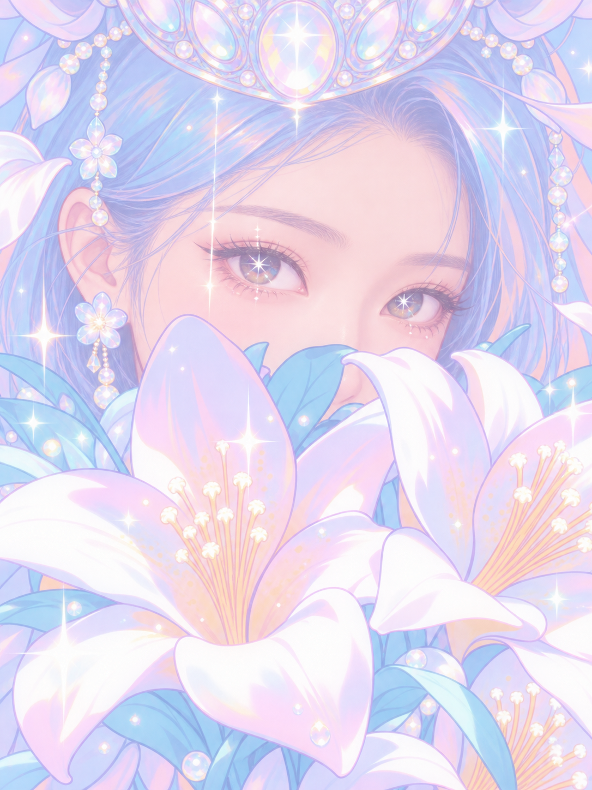</a></td></tr></table>

[实际生成提示词](10-393/prompt.txt) · [案例记录](10-393/case.json)

**生成条件：** 案例记录没有后续修正字段。

<details><summary>观察边界</summary>

五官和头发比模板更细腻，卡通概括程度稍弱；面部部分遮挡。

</details>
